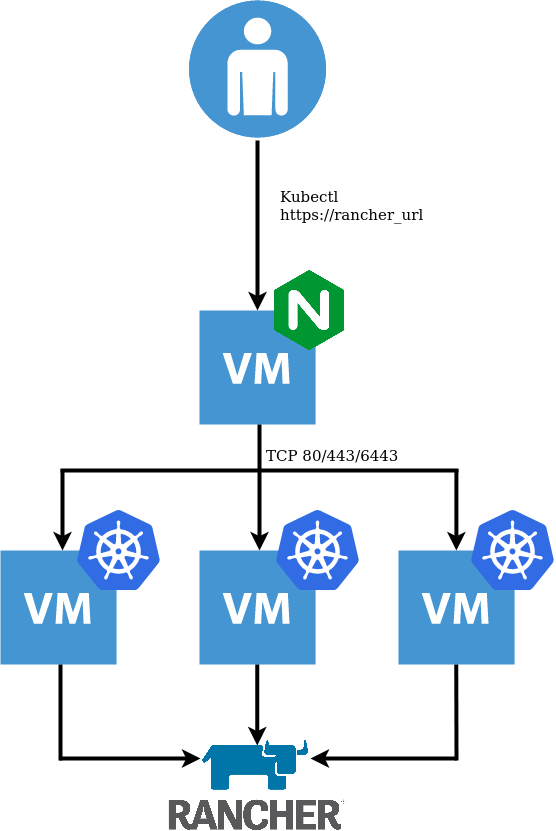

# Rancher and K3s on vSphere Terraform Script



This repo creates the following:

* 1x NGINX Loadbalancer
* 3x K3S Nodes leveraging Embedded HA, forming a K8s Cluster
* Installation of `Cert-Manager` and `Rancher` 

# Prerequisites

* Prior to running this script, a DNS record needs to be created to point at the Loadbalancer IP address, defined in the variable `lb_address`.

* The VM template used must have the `Cloud-Init Datasource for VMware GuestInfo` project installed, which facilitates pulling meta, user, and vendor data from VMware vSphere's GuestInfo interface. This can be achieved with:

```
curl -sSL https://raw.githubusercontent.com/vmware/cloud-init-vmware-guestinfo/master/install.sh | sh -
```

Or use the following Packer Template:

https://github.com/David-VTUK/Rancher-Packer/tree/master/vSphere/ubuntu_2004_cloud_init_guestinfo

# Instructions

* Copy `variables.tfvars.example` as `variables.tfvars`
* Populate as you see fit
* Apply with `terraform apply --var-file variables.tfvars`
* Once comple, Terraform will output the URL for Rancher, IE:

```
Apply complete! Resources: 9 added, 0 changed, 0 destroyed.

Outputs:

rancher_url = https://rancher.virtualthoughts.co.uk
```